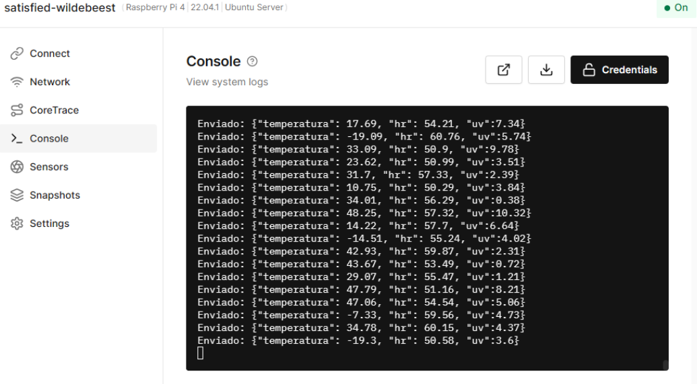
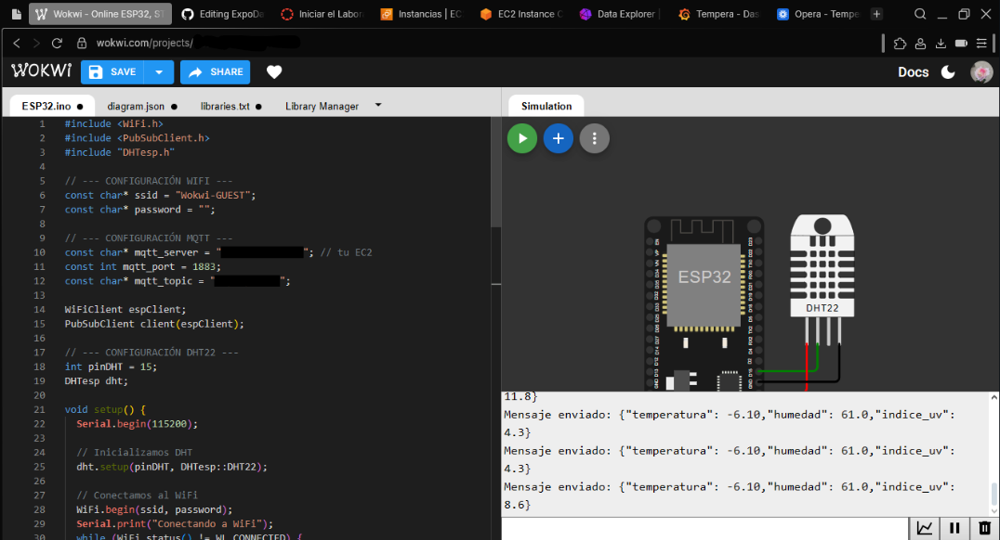
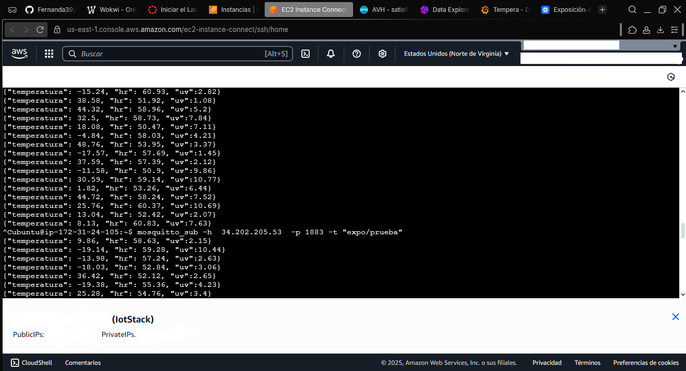
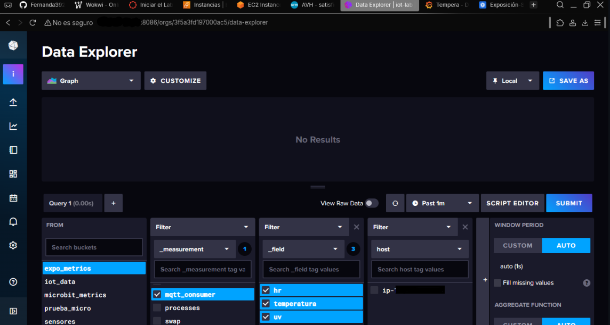
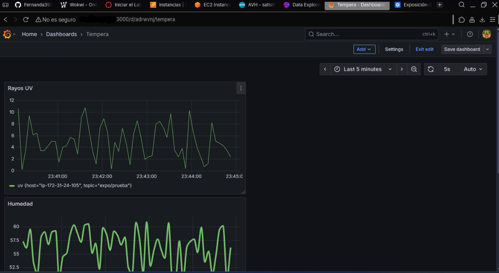
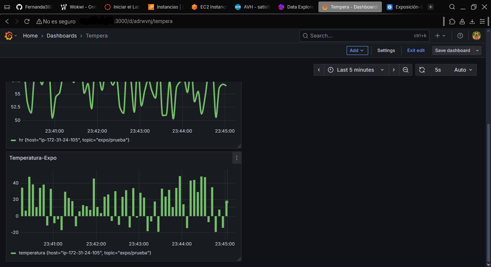

# 📡 Sistema de Monitoreo Ambiental IoT en Tiempo Real (TIG Stack + MQTT)

Monitoreo Ambiental IoT en Tiempo Real (**RTEM**). Este proyecto implementa una solución completa de **observabilidad Full-Stack** para la captura y visualización de métricas ambientales críticas (Temperatura, Humedad, Rayos UV), utilizando **MQTT** para la ingesta de datos en tiempo real, **InfluxDB** como base de datos *Time Series* y **Grafana** para la monitorización interactiva.

---

## ⚙️ Arquitectura y Pila Tecnológica

Este desarrollo utiliza una robusta arquitectura de *pipeline* de datos (TIG Stack) para garantizar la latencia baja y el almacenamiento eficiente de series temporales.

| Componente | Tecnología Clave | Función Principal |
| :--- | :--- | :--- |
| **Publicador (Publisher)** | ESP32 (Wokwi) / Raspberry Pi (Python) | Generación y publicación de datos de sensores. |
| **Protocolo** | **MQTT** (Broker Mosquitto en **AWS EC2**) | Comunicación asíncrona de baja latencia. |
| **Ingesta (Consumer)** | **Telegraf** | Suscribe datos de MQTT y los envía a InfluxDB. |
| **Base de Datos** | **InfluxDB** | Almacenamiento optimizado de series temporales (*Time Series*). |
| **Visualización** | **Grafana** | Creación de dashboards interactivos para BI y alertas. |

---

## 1. 🗺️ Flujo de Datos del Proyecto (*Pipeline*)

El flujo de datos se compone de etapas bien definidas, garantizando la trazabilidad desde el sensor hasta la visualización. 

El *pipeline* implementado es:

$$\text{Python (Simulación) o ESP32} \rightarrow \text{MQTT Broker (AWS)} \rightarrow \text{Telegraf (Consumidor)} \rightarrow \text{InfluxDB (Storage)} \rightarrow \text{Grafana (Visualización)}$$

---

## 2. 🔌 Ingesta y Origen de Datos (Publishers)

Los datos se generan y publican en el *tópico* `expo/prueba` del **Broker Mosquitto** alojado en una instancia de AWS EC2.

### A. Simulación Raspberry Pi (Collerium / Debian)

Se utiliza un script de **Python** (`src/python_publisher/simulator.py`) para simular las lecturas de sensores ambientales y publicarlas mediante la librería `paho-mqtt`.

* **Ubicación del Código:** `src/python_publisher/`
* **Demostración:**



### B. Implementación ESP32 (Wokwi Simulation)

Implementación de *firmware* en C++ (Arduino) para el ESP32 (`src/esp32_publisher/esp32_publisher.ino`) que publica datos simulados mediante la librería `PubSubClient`.

* **Ubicación del Código:** `src/esp32_publisher/`
* **Demostración:**



---

## 3. ☁️ Plataforma y Broker MQTT (AWS EC2)

El broker de mensajería **Mosquitto** está alojado en una instancia de Amazon EC2, actuando como punto central de recolección de todos los publicadores.

* **Verificación del Broker:** Se puede verificar la recepción de datos mediante el comando `mosquitto_sub` en las IP proporcionadas.
    > **Ejemplo de suscripción:** `mosquitto_sub -h 34.202.205.53 -p 1883 -t "expo/prueba"`
    
    > 

---

## 4. 💾 Ingesta y Almacenamiento (Telegraf & InfluxDB)

La herramienta de ingestión **Telegraf** se suscribe al *tópico* del broker MQTT en AWS y alimenta directamente la base de datos **InfluxDB**.

* **Telegraf:** Actúa como el consumidor de MQTT y el agente de escritura en InfluxDB.
* **InfluxDB:** Almacena los datos en el *bucket* `expo_metrics`, listos para ser consultados por Grafana.
  
    > 

---

## 5. 📊 Visualización y Consulta (Grafana)

Los datos se visualizan en un dashboard dinámico de Grafana, utilizando InfluxDB como fuente de datos. Las consultas se realizan en el lenguaje **Flux** para filtrar y graficar las métricas. 

### Consultas Flux de los Paneles

| Métrica Visualizada | Consulta Flux (Propósito) | Panel Demostrativo |
| :--- | :--- | :--- |
| **Temperatura (°C)** | Filtra por el campo `temperatura`. |  |
| **Humedad Relativa (%)** | Filtra por el campo `humedad`. |  |
| **Índice UV** | Filtra por el campo `indice_uv`. | (Añadir imagen si tienes la tercera) |

**Ejemplo de Query Flux (Temperatura):**
```flux
from(bucket: "expo_metrics")
|> range(start: v.timeRangeStart) 
|> filter(fn: (r) => r._measurement == "mqtt_consumer")
|> filter(fn: (r) => r._field == "temperatura")
|> yield(name: "temperatura_celsius")
